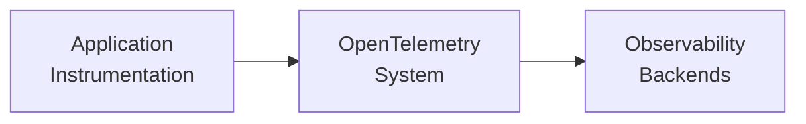
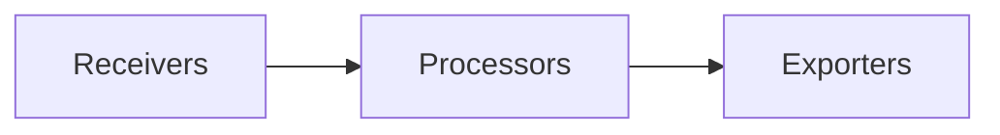
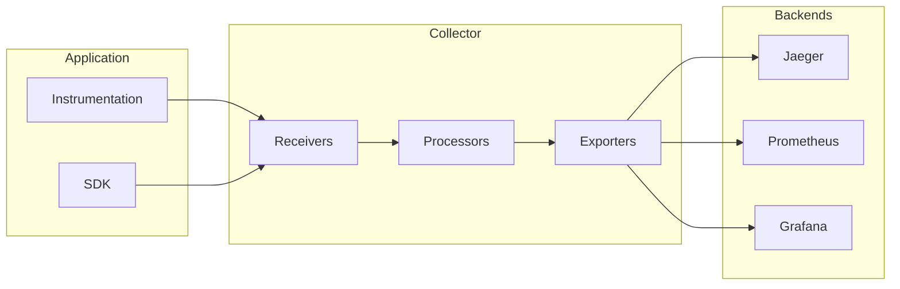

# OpenTelemetry 관측 시스템 전체 구성

## 전체 아키텍처 개요

OpenTelemetry는 관측성 데이터를 수집, 처리, 내보내기 위한 완전한 관측성 프레임워크입니다.



## 주요 구성 요소

### 1. **OpenTelemetry API & SDK**

#### API (Application Programming Interface)
- **목적**: 애플리케이션 코드에서 관측성 데이터를 생성하는 표준 인터페이스
- **특징**: 
  - 언어별로 구현됨 (Python, Java, Go, JavaScript, C#, Rust 등)
  - 벤더 중립적
  - 안정적인 API 보장

```python
# Python API 예시
from opentelemetry import trace
from opentelemetry import metrics

# Tracer 획득
tracer = trace.get_tracer(__name__)

# Span 생성
with tracer.start_as_current_span("operation_name") as span:
    span.set_attribute("user.id", "12345")
    # 비즈니스 로직 실행
```

#### SDK (Software Development Kit)
- **목적**: API의 구체적인 구현체
- **기능**:
  - 데이터 수집 및 배치 처리
  - 샘플링 정책 적용
  - 리소스 정보 추가
  - 내보내기 기능

```python
# Python SDK 설정 예시
from opentelemetry.sdk.trace import TracerProvider
from opentelemetry.sdk.trace.export import BatchSpanProcessor
from opentelemetry.exporter.otlp.proto.grpc.trace_exporter import OTLPSpanExporter

# TracerProvider 설정
trace.set_tracer_provider(TracerProvider())

# Exporter 설정
exporter = OTLPSpanExporter(endpoint="http://localhost:4317")
processor = BatchSpanProcessor(exporter)
trace.get_tracer_provider().add_span_processor(processor)
```

### 2. **Instrumentation (계측)**

#### Auto-Instrumentation (자동 계측)
- **목적**: 코드 수정 없이 자동으로 관측성 데이터 생성
- **지원 라이브러리**: HTTP 클라이언트, 데이터베이스, 메시징 시스템 등

```bash
# Python 자동 계측 설치 및 실행
pip install opentelemetry-distro[otlp]
opentelemetry-bootstrap -a install
opentelemetry-instrument python app.py
```

```javascript
// Node.js 자동 계측
const { NodeSDK } = require('@opentelemetry/sdk-node');
const { getNodeAutoInstrumentations } = require('@opentelemetry/auto-instrumentations-node');

const sdk = new NodeSDK({
  instrumentations: [getNodeAutoInstrumentations()]
});
sdk.start();
```

#### Manual Instrumentation (수동 계측)
- **목적**: 커스텀 비즈니스 로직에 대한 세밀한 관측성 제어

```python
# 수동 계측 예시
@tracer.start_as_current_span("process_order")
def process_order(order_id):
    span = trace.get_current_span()
    span.set_attribute("order.id", order_id)
    span.set_attribute("order.value", 100.0)
    
    # 커스텀 이벤트 추가
    span.add_event("order_validation_started")
    
    try:
        # 비즈니스 로직
        validate_order(order_id)
        span.set_status(trace.Status(trace.StatusCode.OK))
    except Exception as e:
        span.set_status(trace.Status(trace.StatusCode.ERROR, str(e)))
        span.record_exception(e)
        raise
```

### 3. **OpenTelemetry Collector**

#### 역할과 목적
- **데이터 수집**: 다양한 소스에서 관측성 데이터 수집
- **데이터 처리**: 필터링, 변환, 농축, 배치 처리
- **데이터 내보내기**: 다양한 백엔드로 데이터 전송

#### 아키텍처



#### Collector 설정 예시
```yaml
# collector-config.yaml
receivers:
  otlp:
    protocols:
      grpc:
        endpoint: 0.0.0.0:4317
      http:
        endpoint: 0.0.0.0:4318
  
  prometheus:
    config:
      scrape_configs:
        - job_name: 'my-app'
          static_configs:
            - targets: ['localhost:8080']

processors:
  batch:
    timeout: 1s
    send_batch_size: 1024
  
  memory_limiter:
    limit_mib: 512
  
  attributes:
    actions:
      - key: environment
        value: production
        action: insert

exporters:
  otlp/jaeger:
    endpoint: http://jaeger:14250
    tls:
      insecure: true
  
  prometheusremotewrite:
    endpoint: http://prometheus:9090/api/v1/write

service:
  pipelines:
    traces:
      receivers: [otlp]
      processors: [memory_limiter, batch, attributes]
      exporters: [otlp/jaeger]
    
    metrics:
      receivers: [otlp, prometheus]
      processors: [memory_limiter, batch]
      exporters: [prometheusremotewrite]
  
  extensions: [health_check, pprof]
```

### 4. **Three Pillars of Observability (관측성의 3요소)**

#### 4.1 Traces (분산 추적)
- **목적**: 요청이 시스템을 통과하는 경로 추적
- **구성 요소**:
  - **Trace**: 하나의 요청에 대한 전체 여정
  - **Span**: 작업의 단일 단위
  - **SpanContext**: 추적 정보 전파

```python
# Tracing 예시
from opentelemetry import trace
from opentelemetry.propagate import extract

tracer = trace.get_tracer(__name__)

def handle_request(request):
    # 부모 컨텍스트 추출
    parent_context = extract(request.headers)
    
    with tracer.start_as_current_span(
        "handle_request", 
        context=parent_context
    ) as span:
        span.set_attribute("http.method", request.method)
        span.set_attribute("http.url", request.url)
        
        # 하위 서비스 호출
        call_downstream_service()
```

#### 4.2 Metrics (메트릭)
- **목적**: 시간에 따른 수치 데이터 측정
- **메트릭 타입**:
  - **Counter**: 누적 값 (요청 수, 에러 수)
  - **Gauge**: 현재 값 (메모리 사용량, 큐 크기)
  - **Histogram**: 값의 분포 (응답 시간, 요청 크기)

```python
# Metrics 예시
from opentelemetry import metrics

meter = metrics.get_meter(__name__)

# Counter 메트릭
request_counter = meter.create_counter(
    name="http_requests_total",
    description="Total number of HTTP requests"
)

# Histogram 메트릭
response_time_histogram = meter.create_histogram(
    name="http_request_duration_seconds",
    description="HTTP request duration in seconds"
)

def handle_request():
    start_time = time.time()
    
    # 요청 카운터 증가
    request_counter.add(1, {"method": "GET", "endpoint": "/api/users"})
    
    # 비즈니스 로직 처리
    process_request()
    
    # 응답 시간 기록
    duration = time.time() - start_time
    response_time_histogram.record(duration, {"method": "GET"})
```

#### 4.3 Logs (로그)
- **목적**: 구조화된 이벤트 기록
- **특징**: 
  - 구조화된 로그 (JSON)
  - 추적 컨텍스트와 연관
  - 다양한 심각도 레벨

```python
# Structured Logging 예시
import logging
from opentelemetry import trace

# 추적 컨텍스트가 포함된 로깅
def log_with_trace_context(message, level=logging.INFO):
    span = trace.get_current_span()
    span_context = span.get_span_context()
    
    logger.log(level, message, extra={
        "trace_id": f"{span_context.trace_id:032x}",
        "span_id": f"{span_context.span_id:016x}",
        "service_name": "my-service"
    })
```

### 5. **Context Propagation (컨텍스트 전파)**

#### 목적
- 분산 시스템에서 추적 정보를 서비스 간에 전파
- 요청의 전체 여정을 연결

#### 전파 메커니즘
```python
# HTTP 헤더를 통한 컨텍스트 전파
from opentelemetry.propagate import inject, extract

# 송신 측 (클라이언트)
headers = {}
inject(headers)  # 현재 컨텍스트를 헤더에 주입
requests.post("http://service-b/api", headers=headers)

# 수신 측 (서버)
parent_context = extract(request.headers)  # 헤더에서 컨텍스트 추출
with tracer.start_as_current_span("process", context=parent_context):
    # 처리 로직
    pass
```

### 6. **Sampling (샘플링)**

#### 목적
- 성능 영향 최소화
- 스토리지 비용 절약
- 대표적인 데이터 유지

#### 샘플링 전략
```python
from opentelemetry.sdk.trace.sampling import (
    TraceIdRatioBased,
    ParentBased,
    ALWAYS_ON,
    ALWAYS_OFF
)

# 10% 샘플링
sampler = TraceIdRatioBased(0.1)

# 부모 기반 샘플링
sampler = ParentBased(root=TraceIdRatioBased(0.1))

# TracerProvider에 적용
tracer_provider = TracerProvider(sampler=sampler)
```

### 7. **Resource Detection (리소스 감지)**

#### 목적
- 애플리케이션과 실행 환경 정보 자동 감지
- 컨텍스트 메타데이터 제공

```python
from opentelemetry.sdk.resources import Resource
from opentelemetry.semconv.resource import ResourceAttributes

# 리소스 정보 설정
resource = Resource.create({
    ResourceAttributes.SERVICE_NAME: "my-service",
    ResourceAttributes.SERVICE_VERSION: "1.0.0",
    ResourceAttributes.DEPLOYMENT_ENVIRONMENT: "production",
    ResourceAttributes.HOST_NAME: "web-server-01"
})

tracer_provider = TracerProvider(resource=resource)
```

## 실제 구성 예시

### 마이크로서비스 환경
```yaml
# docker-compose.yml
version: '3.8'
services:
  # 애플리케이션 서비스들
  user-service:
    build: ./user-service
    environment:
      - OTEL_EXPORTER_OTLP_ENDPOINT=http://otel-collector:4317
      - OTEL_SERVICE_NAME=user-service
      - OTEL_RESOURCE_ATTRIBUTES=service.version=1.0.0,deployment.environment=production

  order-service:
    build: ./order-service
    environment:
      - OTEL_EXPORTER_OTLP_ENDPOINT=http://otel-collector:4317
      - OTEL_SERVICE_NAME=order-service

  # OpenTelemetry Collector
  otel-collector:
    image: otel/opentelemetry-collector-contrib:latest
    command: ["--config=/etc/collector-config.yaml"]
    volumes:
      - ./collector-config.yaml:/etc/collector-config.yaml
    ports:
      - "4317:4317"   # OTLP gRPC
      - "4318:4318"   # OTLP HTTP
      - "8888:8888"   # Prometheus metrics

  # 관측성 백엔드
  jaeger:
    image: jaegertracing/all-in-one:latest
    ports:
      - "16686:16686" # Jaeger UI

  prometheus:
    image: prom/prometheus:latest
    ports:
      - "9090:9090"

  grafana:
    image: grafana/grafana:latest
    ports:
      - "3000:3000"
```

### Kubernetes 환경
```yaml
# opentelemetry-operator.yaml
apiVersion: opentelemetry.io/v1alpha1
kind: OpenTelemetryCollector
metadata:
  name: otel-collector
spec:
  config: |
    receivers:
      otlp:
        protocols:
          grpc:
            endpoint: 0.0.0.0:4317
          http:
            endpoint: 0.0.0.0:4318
    
    processors:
      batch:
      memory_limiter:
        limit_mib: 512
    
    exporters:
      jaeger:
        endpoint: jaeger-collector:14250
        tls:
          insecure: true
    
    service:
      pipelines:
        traces:
          receivers: [otlp]
          processors: [memory_limiter, batch]
          exporters: [jaeger]
---
apiVersion: opentelemetry.io/v1alpha1
kind: Instrumentation
metadata:
  name: my-instrumentation
spec:
  exporter:
    endpoint: http://otel-collector:4317
  propagators:
    - tracecontext
    - baggage
  sampler:
    type: parentbased_traceidratio
    argument: "0.1"
  python:
    image: ghcr.io/open-telemetry/opentelemetry-operator/autoinstrumentation-python:latest
  nodejs:
    image: ghcr.io/open-telemetry/opentelemetry-operator/autoinstrumentation-nodejs:latest
```

## 데이터 플로우



## 모범 사례

### 1. 계측 전략
- 자동 계측부터 시작
- 중요한 비즈니스 로직에 수동 계측 추가
- 적절한 샘플링 비율 설정

### 2. 성능 고려사항
- 배치 처리 활용
- 메모리 제한 설정
- 비동기 내보내기 사용

### 3. 보안
- 민감한 데이터 제거
- TLS 연결 사용
- 인증/권한 부여 적용

### 4. 운영
- Collector 고가용성 구성
- 모니터링 및 알림 설정
- 백업 및 복구 계획

## 결론

OpenTelemetry는 현대적인 분산 시스템에서 완전한 관측성을 제공하는 강력한 프레임워크입니다. 각 구성 요소가 유기적으로 연결되어 애플리케이션의 성능, 안정성, 사용자 경험을 향상시키는 데 필요한 인사이트를 제공합니다.


---

OpenTelemetry, Grafana, Loki, Tempo, Prometheus를 활용한 Spring Boot Observability 구성하기

<https://medium.com/@dudwls96/opentelemetry-grafana-loki-tempo-prometheus를-활용한-spring-boot-observability-구성하기-f977df45bb70>
