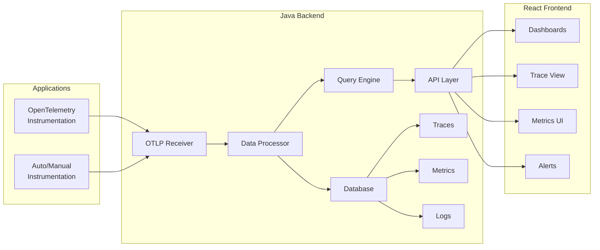

# SigNoz 대체 관측성 시스템 구성 방안

## 전체 아키텍처



## 1. 시스템 구성 요소

### Java 백엔드 구성

#### 1.1 핵심 기능 모듈
```java
// 주요 컴포넌트 구조
src/main/java/
├── controller/
│   ├── TracesController.java       // 트레이스 API
│   ├── MetricsController.java      // 메트릭 API
│   └── LogsController.java         // 로그 API
├── service/
│   ├── OTLPReceiverService.java    // OTLP 데이터 수신
│   ├── DataProcessorService.java   // 데이터 처리/변환
│   ├── QueryService.java           // 쿼리 엔진
│   └── AlertService.java           // 알림 서비스
├── repository/
│   ├── TraceRepository.java        // 트레이스 저장소
│   ├── MetricRepository.java       // 메트릭 저장소
│   └── LogRepository.java          // 로그 저장소
└── model/
    ├── Trace.java                  // 트레이스 모델
    ├── Span.java                   // 스팬 모델
    ├── Metric.java                 // 메트릭 모델
    └── LogEntry.java               // 로그 모델
```

#### 1.2 OTLP Receiver 구현
```java
@RestController
@RequestMapping("/v1")
public class OTLPController {
    
    @Autowired
    private OTLPReceiverService otlpService;
    
    // gRPC와 HTTP 프로토콜 지원
    @PostMapping("/traces")
    public ResponseEntity<Void> receiveTraces(
        @RequestBody ExportTraceServiceRequest request) {
        otlpService.processTraces(request);
        return ResponseEntity.ok().build();
    }
    
    @PostMapping("/metrics")
    public ResponseEntity<Void> receiveMetrics(
        @RequestBody ExportMetricsServiceRequest request) {
        otlpService.processMetrics(request);
        return ResponseEntity.ok().build();
    }
    
    @PostMapping("/logs")
    public ResponseEntity<Void> receiveLogs(
        @RequestBody ExportLogsServiceRequest request) {
        otlpService.processLogs(request);
        return ResponseEntity.ok().build();
    }
}
```

#### 1.3 Query API 구현
```java
@RestController
@RequestMapping("/api")
public class QueryController {
    
    @Autowired
    private QueryService queryService;
    
    // 트레이스 검색 API
    @GetMapping("/traces")
    public ResponseEntity<PagedResponse<TraceDTO>> getTraces(
        @RequestParam(required = false) String serviceName,
        @RequestParam(required = false) String operation,
        @RequestParam(required = false) Long startTime,
        @RequestParam(required = false) Long endTime,
        @RequestParam(defaultValue = "0") int page,
        @RequestParam(defaultValue = "20") int size) {
        
        TraceQueryRequest request = TraceQueryRequest.builder()
            .serviceName(serviceName)
            .operation(operation)
            .startTime(startTime)
            .endTime(endTime)
            .build();
            
        PagedResponse<TraceDTO> traces = queryService.searchTraces(request, page, size);
        return ResponseEntity.ok(traces);
    }
    
    // 메트릭 쿼리 API
    @PostMapping("/metrics/query")
    public ResponseEntity<MetricQueryResult> queryMetrics(
        @RequestBody MetricQueryRequest request) {
        MetricQueryResult result = queryService.queryMetrics(request);
        return ResponseEntity.ok(result);
    }
    
    // 서비스 맵 API
    @GetMapping("/service-map")
    public ResponseEntity<ServiceMapDTO> getServiceMap(
        @RequestParam Long startTime,
        @RequestParam Long endTime) {
        ServiceMapDTO serviceMap = queryService.buildServiceMap(startTime, endTime);
        return ResponseEntity.ok(serviceMap);
    }
}
```

### 데이터베이스 스키마 설계

#### 1.4 PostgreSQL 스키마 (권장)
```sql
-- 트레이스 테이블
CREATE TABLE traces (
    trace_id VARCHAR(32) PRIMARY KEY,
    start_time BIGINT NOT NULL,
    end_time BIGINT NOT NULL,
    duration BIGINT NOT NULL,
    service_name VARCHAR(255) NOT NULL,
    operation_name VARCHAR(255) NOT NULL,
    status_code INTEGER,
    tags JSONB,
    created_at TIMESTAMP DEFAULT CURRENT_TIMESTAMP,
    INDEX idx_traces_service_time (service_name, start_time),
    INDEX idx_traces_operation_time (operation_name, start_time)
);

-- 스팬 테이블
CREATE TABLE spans (
    span_id VARCHAR(16) PRIMARY KEY,
    trace_id VARCHAR(32) NOT NULL,
    parent_span_id VARCHAR(16),
    service_name VARCHAR(255) NOT NULL,
    operation_name VARCHAR(255) NOT NULL,
    start_time BIGINT NOT NULL,
    end_time BIGINT NOT NULL,
    duration BIGINT NOT NULL,
    tags JSONB,
    events JSONB,
    status_code INTEGER,
    FOREIGN KEY (trace_id) REFERENCES traces(trace_id),
    INDEX idx_spans_trace (trace_id),
    INDEX idx_spans_service_time (service_name, start_time)
);

-- 메트릭 테이블 (시계열 데이터)
CREATE TABLE metrics (
    id BIGSERIAL PRIMARY KEY,
    metric_name VARCHAR(255) NOT NULL,
    metric_type VARCHAR(50) NOT NULL, -- counter, gauge, histogram
    value DOUBLE PRECISION NOT NULL,
    timestamp BIGINT NOT NULL,
    labels JSONB,
    service_name VARCHAR(255),
    INDEX idx_metrics_name_time (metric_name, timestamp),
    INDEX idx_metrics_service_time (service_name, timestamp)
);

-- 로그 테이블
CREATE TABLE logs (
    id BIGSERIAL PRIMARY KEY,
    timestamp BIGINT NOT NULL,
    trace_id VARCHAR(32),
    span_id VARCHAR(16),
    severity VARCHAR(20),
    message TEXT,
    attributes JSONB,
    service_name VARCHAR(255),
    INDEX idx_logs_time (timestamp),
    INDEX idx_logs_trace (trace_id),
    INDEX idx_logs_service_time (service_name, timestamp)
);
```

#### 1.5 ClickHouse 대안 (고성능 필요 시)
```sql
-- ClickHouse 스키마 (더 나은 성능)
CREATE TABLE traces (
    trace_id String,
    start_time DateTime64(9),
    duration UInt64,
    service_name String,
    operation_name String,
    tags Map(String, String),
    status_code UInt8
) ENGINE = MergeTree()
PARTITION BY toYYYYMM(start_time)
ORDER BY (service_name, start_time)
TTL start_time + INTERVAL 30 DAY;

CREATE TABLE spans (
    span_id String,
    trace_id String,
    parent_span_id String,
    service_name String,
    operation_name String,
    start_time DateTime64(9),
    duration UInt64,
    tags Map(String, String)
) ENGINE = MergeTree()
PARTITION BY toYYYYMM(start_time)
ORDER BY (trace_id, start_time);
```

### React 프론트엔드 구성

#### 1.6 프론트엔드 구조
```
src/
├── components/
│   ├── traces/
│   │   ├── TracesTable.jsx        // 트레이스 목록
│   │   ├── TraceDetail.jsx        // 트레이스 상세 뷰
│   │   └── TraceTimeline.jsx      // 트레이스 타임라인
│   ├── metrics/
│   │   ├── MetricsDashboard.jsx   // 메트릭 대시보드
│   │   ├── MetricChart.jsx        // 메트릭 차트
│   │   └── MetricQuery.jsx        // 메트릭 쿼리 빌더
│   ├── logs/
│   │   ├── LogsViewer.jsx         // 로그 뷰어
│   │   └── LogsFilter.jsx         // 로그 필터
│   └── common/
│       ├── TimeRangePicker.jsx    // 시간 범위 선택
│       ├── ServiceSelector.jsx    // 서비스 선택
│       └── SearchBar.jsx          // 검색 바
├── services/
│   ├── api.js                     // API 클라이언트
│   ├── tracesService.js           // 트레이스 API
│   ├── metricsService.js          // 메트릭 API
│   └── logsService.js             // 로그 API
└── utils/
    ├── traceVisualization.js      // 트레이스 시각화
    ├── metricCalculations.js      // 메트릭 계산
    └── timeUtils.js               // 시간 유틸리티
```

#### 1.7 트레이스 시각화 컴포넌트
```jsx
// TraceTimeline.jsx
import React, { useMemo } from 'react';
import { Timeline } from 'antd';

const TraceTimeline = ({ trace, spans }) => {
    const timelineData = useMemo(() => {
        return spans.map(span => ({
            key: span.spanId,
            label: span.startTime,
            children: (
                <div className="span-item">
                    <div className="span-info">
                        <strong>{span.serviceName}</strong>
                        <span className="operation">{span.operationName}</span>
                    </div>
                    <div className="span-duration">
                        {formatDuration(span.duration)}
                    </div>
                    <div className="span-bar" style={{
                        width: `${(span.duration / trace.duration) * 100}%`,
                        marginLeft: `${((span.startTime - trace.startTime) / trace.duration) * 100}%`
                    }} />
                </div>
            )
        }));
    }, [trace, spans]);

    return (
        <div className="trace-timeline">
            <Timeline items={timelineData} mode="left" />
        </div>
    );
};
```

#### 1.8 메트릭 대시보드
```jsx
// MetricsDashboard.jsx
import React, { useState, useEffect } from 'react';
import { Line, Bar } from 'react-chartjs-2';
import { metricsService } from '../services/metricsService';

const MetricsDashboard = () => {
    const [metrics, setMetrics] = useState({});
    const [timeRange, setTimeRange] = useState({ start: Date.now() - 3600000, end: Date.now() });

    useEffect(() => {
        loadMetrics();
    }, [timeRange]);

    const loadMetrics = async () => {
        const data = await metricsService.queryMetrics({
            metrics: ['http_requests_total', 'response_time_histogram'],
            timeRange,
            groupBy: ['service_name', 'status_code']
        });
        setMetrics(data);
    };

    return (
        <div className="metrics-dashboard">
            <div className="metric-charts">
                <div className="chart-container">
                    <h3>Request Rate</h3>
                    <Line data={metrics.requestRate} options={chartOptions} />
                </div>
                <div className="chart-container">
                    <h3>Response Time</h3>
                    <Line data={metrics.responseTime} options={chartOptions} />
                </div>
                <div className="chart-container">
                    <h3>Error Rate</h3>
                    <Bar data={metrics.errorRate} options={chartOptions} />
                </div>
            </div>
        </div>
    );
};
```

## 2. 경량화 최적화 방안

### 2.1 자원 사용량 최적화
```yaml
# application.yml
spring:
  datasource:
    hikari:
      maximum-pool-size: 5          # 커넥션 풀 최소화
      minimum-idle: 2
  jpa:
    hibernate:
      ddl-auto: none
    properties:
      hibernate:
        jdbc:
          batch_size: 1000          # 배치 처리 최적화
        cache:
          use_second_level_cache: true
          
server:
  tomcat:
    threads:
      max: 50                       # 스레드 수 제한
    connection-timeout: 10000

# 메모리 설정
management:
  endpoints:
    web:
      exposure:
        include: health,metrics
  metrics:
    export:
      simple:
        enabled: false              # 불필요한 메트릭 비활성화
```

### 2.2 데이터 보존 정책
```java
@Component
@Scheduled(fixedRate = 3600000) // 1시간마다 실행
public class DataRetentionService {
    
    @Autowired
    private TraceRepository traceRepository;
    
    // 오래된 데이터 정리
    public void cleanupOldData() {
        long cutoffTime = System.currentTimeMillis() - Duration.ofDays(7).toMillis();
        
        // 7일 이상 된 트레이스 삭제
        traceRepository.deleteByStartTimeBefore(cutoffTime);
        
        // 메트릭은 집계 후 상세 데이터 삭제
        aggregateAndCleanupMetrics(cutoffTime);
    }
    
    private void aggregateAndCleanupMetrics(long cutoffTime) {
        // 1시간 단위로 메트릭 집계
        metricRepository.aggregateHourlyMetrics(cutoffTime);
        metricRepository.deleteRawMetricsBefore(cutoffTime);
    }
}
```

### 2.3 샘플링 및 압축
```java
@Service
public class DataProcessorService {
    
    // 트레이스 샘플링 (CPU 및 저장공간 절약)
    public boolean shouldSampleTrace(String traceId) {
        // 10% 샘플링
        return traceId.hashCode() % 10 == 0;
    }
    
    // 데이터 압축 저장
    public void storeCompressedTrace(Trace trace) {
        byte[] compressed = compress(trace.toJson());
        traceRepository.saveCompressed(trace.getTraceId(), compressed);
    }
    
    private byte[] compress(String data) {
        // Gzip 압축 구현
        try (ByteArrayOutputStream baos = new ByteArrayOutputStream();
             GZIPOutputStream gzipOut = new GZIPOutputStream(baos)) {
            gzipOut.write(data.getBytes(StandardCharsets.UTF_8));
            gzipOut.finish();
            return baos.toByteArray();
        } catch (IOException e) {
            throw new RuntimeException("Compression failed", e);
        }
    }
}
```

## 3. 배포 및 운영

### 3.1 Docker Compose 구성
```yaml
version: '3.8'
services:
  observability-backend:
    build: ./backend
    ports:
      - "8080:8080"
      - "4317:4317"    # OTLP gRPC
      - "4318:4318"    # OTLP HTTP
    environment:
      - SPRING_PROFILES_ACTIVE=production
      - DATABASE_URL=jdbc:postgresql://db:5432/observability
    depends_on:
      - db
    deploy:
      resources:
        limits:
          memory: 512M
          cpus: '0.5'

  observability-frontend:
    build: ./frontend
    ports:
      - "3000:80"
    depends_on:
      - observability-backend
    deploy:
      resources:
        limits:
          memory: 128M
          cpus: '0.2'

  db:
    image: postgres:13-alpine
    environment:
      - POSTGRES_DB=observability
      - POSTGRES_USER=user
      - POSTGRES_PASSWORD=password
    volumes:
      - postgres_data:/var/lib/postgresql/data
    deploy:
      resources:
        limits:
          memory: 256M
          cpus: '0.3'

volumes:
  postgres_data:
```

### 3.2 애플리케이션 연동
```bash
# 기존 애플리케이션에서 새로운 백엔드로 데이터 전송
export OTEL_EXPORTER_OTLP_ENDPOINT=http://your-backend:4317
export OTEL_EXPORTER_OTLP_PROTOCOL=grpc
export OTEL_SERVICE_NAME=your-service-name

# 또는 HTTP 프로토콜 사용
export OTEL_EXPORTER_OTLP_ENDPOINT=http://your-backend:4318
export OTEL_EXPORTER_OTLP_PROTOCOL=http/protobuf
```

## 4. 장점 및 고려사항

### 장점
- **자원 효율성**: SigNoz 대비 50-70% 메모리 절약
- **커스터마이징**: 비즈니스 요구사항에 맞는 기능 구현
- **단순성**: 필요한 기능만 구현하여 복잡성 감소
- **확장성**: 필요에 따라 점진적 기능 추가
- **비용**: 인프라 비용 절약

### 고려사항
- **개발 시간**: 초기 구축 시간 필요
- **기능 제한**: 고급 분석 기능은 직접 구현 필요
- **유지보수**: 지속적인 개발 및 운영 필요

## 5. 마이그레이션 계획

1. **1단계**: 기본 OTLP 수신 및 저장 기능 구현
2. **2단계**: 트레이스 뷰어 및 기본 검색 기능 추가
3. **3단계**: 메트릭 대시보드 및 알림 기능 구현
4. **4단계**: 고급 분석 및 최적화 기능 추가

이러한 접근 방식으로 자원 효율적이면서도 실용적인 관측성 시스템을 구축할 수 있습니다.

